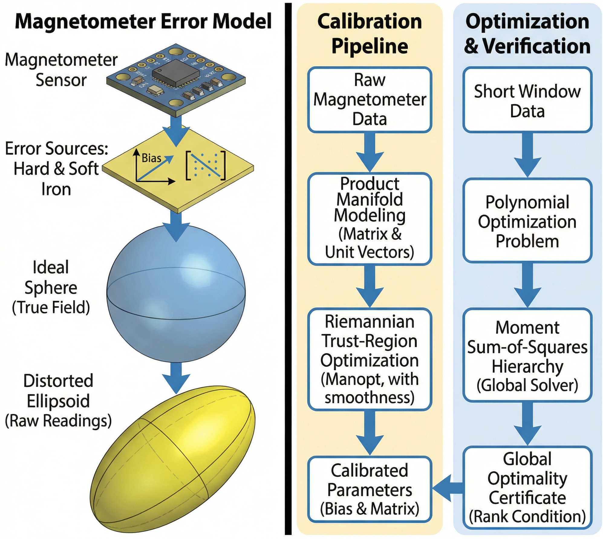
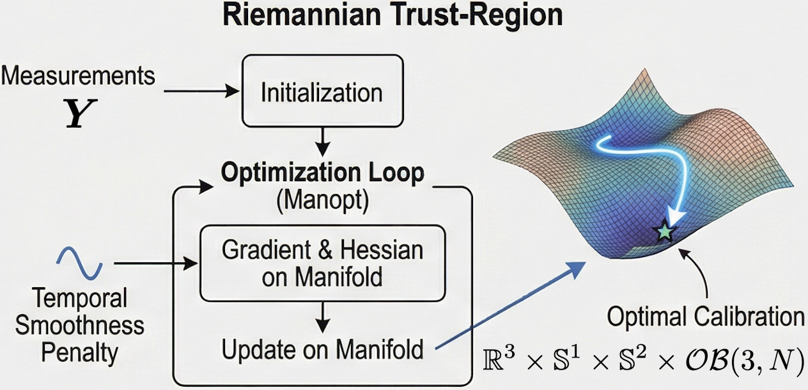
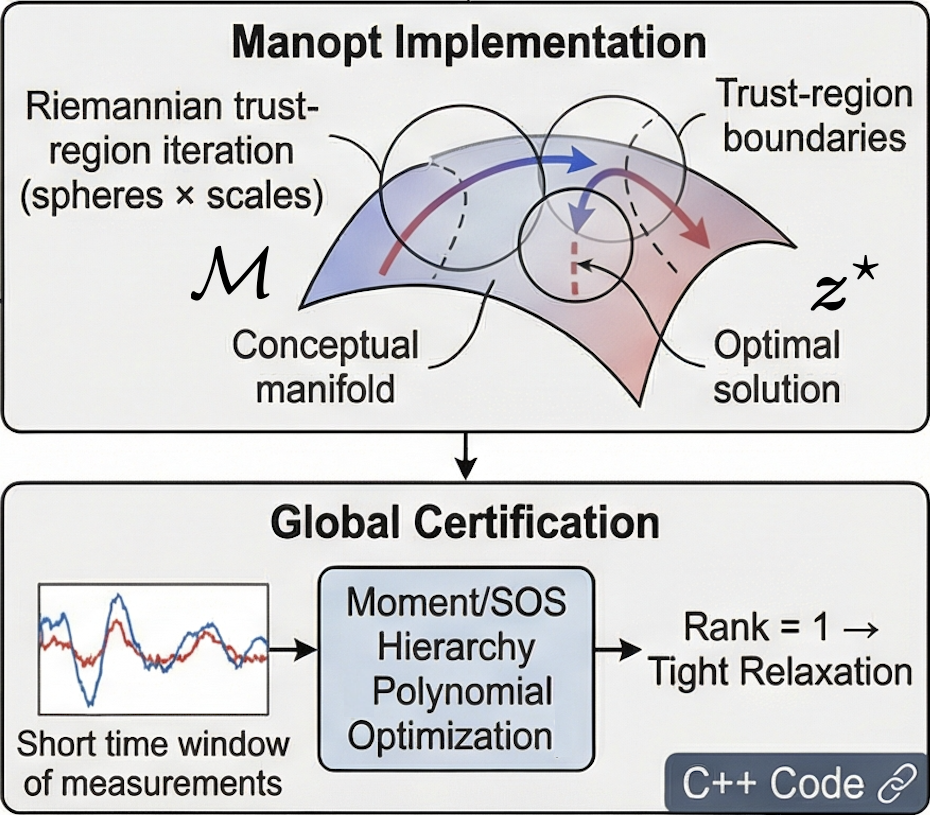
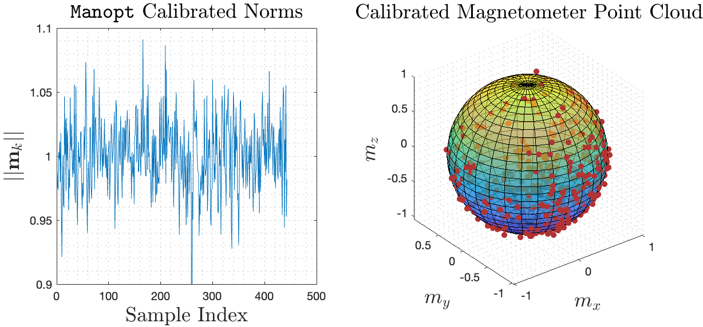
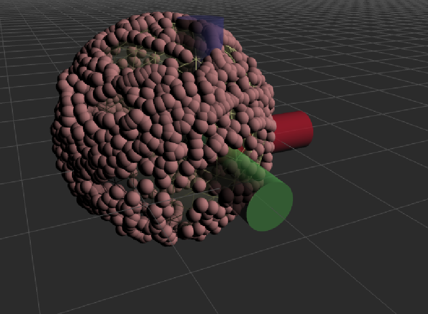

# Oblique-Mag-Calib
[](https://isocpp.org/)[](https://github.com/zarathustr/oblique-mag-calib/stargazers) [](https://github.com/zarathustr/LibC3P/issues)

<div align="center">
    
    <br>
    <em>The proposed magnetometer calibration algorithm. (Left) Exploded view of the sensor error model (inversely), transforming an ideal sphere into a distorted ellipsoid. (Right) Schematic view of the calibration pipeline and global verification process.</em>
</div>

------

C++17 implementation of the **magnetometer calibration** pipeline used in the MATLAB packages:

1. **Global algebraic ellipsoid initialization** (Wu 2015 initialization):
   - Fits an ellipsoid to raw magnetometer measurements
   - Recovers the bias `h0` and an upper triangular matrix `T0`

2. **Product-manifold refinement** (Manopt-like) using Riemannian gradient descent on:
   - `t2 ∈ S^1`, `t3 ∈ S^2` (directions parameterizing the upper triangular `T`)
   - `s ∈ R^3` (log-scales -> positive diagonal)
   - `h ∈ R^3` (bias)
   - `M ∈ Oblique(3,N)` (unit-norm calibrated directions)

3. **Ellipsoid mesh export** (OBJ) for visualization:
   - `ellipsoid_init.obj` from the algebraic ellipsoid
   - `ellipsoid_hat.obj` from refined `(T,h)`

## Dependencies

- Eigen3 (headers)
- CMake ≥ 3.16
- A C++17 compiler

Ubuntu:
```bash
sudo apt-get install -y libeigen3-dev cmake g++
```

## Build

```bash
mkdir -p build && cd build
cmake ..
cmake --build . -j
```

## Run

### On one TXT file
```bash
./magcal_run --input /path/to/ust-nautilus-mag-calib-2025-08-26-19-06-50.txt --outdir out_nautilus --downsample 2 --lambda 0.05 --maxiter 300
```

Notes:
- These CSV logs must follow the Microstrain-style format with a `DATA_START` marker and a header row containing `X Mag`, `Y Mag`, `Z Mag`.
- If your CSV uses different column names, adjust `CsvLoadOptions` in code or extend the CLI.

TXT log support:
- For the UST Nautilus TXT logs, each line must contain 10 numeric fields:
  `seq gx gy gz ax ay az mx my mz`.
- Magnetometer values are taken from the last three fields.

## Outputs

In `outdir`:
- `T_init.txt`, `h_init.txt`, `A_init.txt`
- `T_hat.txt`, `h_hat.txt`, `A_hat.txt`
- `calibrated.csv` (3 columns `mx,my,mz`)
- `ellipsoid_init.obj`, `ellipsoid_hat.obj`

You can open OBJ meshes in MeshLab or Blender.

# MATLAB code

<div align="center">
    
    
    <br>
    <em>Left: The local solution strategy on the Riemannian manifold. In our setting, the search space is the product manifold; Right: The moment SOS framework for certified semidefinite relaxations via polynomial optimization.</em>
</div>

## Dependencies
- Manopt (Riemannian optimization in MATLAB): https://www.manopt.org
- Optional for global certification:
  - GloptiPoly 3: https://homepages.laas.fr/henrion/software/gloptipoly3/
  - An SDP solver supported by GloptiPoly such as SeDuMi.

## Quick start
1. Add Manopt to your MATLAB path.
2. Run the continuous-motion simulation and product-manifold solver:

```matlab
addpath(genpath('path/to/manopt'));
addpath(genpath(pwd));
```

## Real data: UST Nautilus TXT logs

This package also includes loaders for the UST Nautilus log format:

Each line contains 10 numeric fields:
`seq gx gy gz ax ay az mx my mz`.

The magnetometer samples are the last three fields.

Run the real-data experiment (requires Manopt; GloptiPoly optional):

```matlab
addpath(genpath('path/to/manopt'));
addpath(genpath(pwd));
run('realdata_nautilus/run_nautilus_experiment.m');
```

<div align="center">
    
    <br>
    
    <br>
    <em>Magnetometer calibration results indicate high accuracy. The red spheres are sampled magnetic field measurements while the wireframe denotes the calibrated ellipsoid mesh.</em>
</div>


## Citation

If you find this work useful for your research, please cite our paper:

```bash
@article{wu2026oblique,
  title={Three-Axis Magnetometer Calibration on Euclidean-Oblique Product Manifold},
  author={Wu, Jin and Jiang, Yi and Li, Chong and Zhang, Chengxi and He, Zhijian and Zhang, Wei},
  journal={Submission to IEEE Transactions on Industrial Electronics},
  year={2026},
  publisher={Arxiv},
  url={[https://github.com/zarathustr/oblique-mag-calib](https://github.com/zarathustr/oblique-mag-calib)}
}
```

------

## Issues

For any questions, please open an issue or contact `wujin@ustb.edu.cn` or `hezhijian@sztu.edu.cn`.


